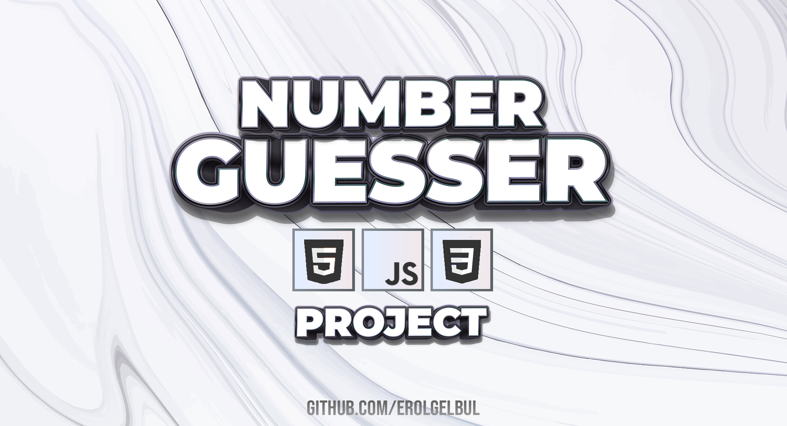
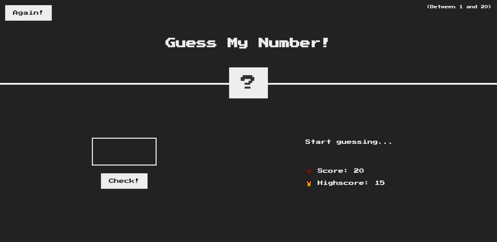
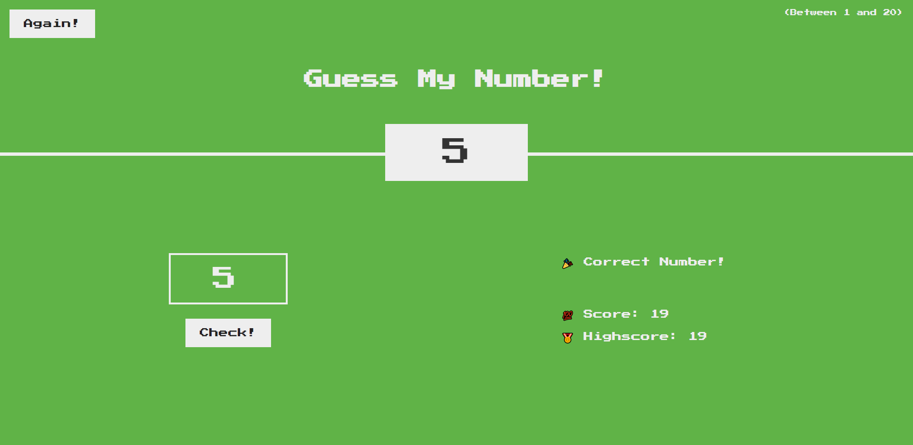

<!-- ABOUT THE PROJECT -->
## 1. Overview

The Number Guesser game is a simple web-based game in which the player attempts
to guess a randomly generated secret number between 1 and 20. Players have a
score that starts at 20 and decreases by 1 for each incorrect guess. The game
keeps track of the player's high score.

### 1.1 Initial Screen

  

<!-- TECH STACK -->
## 2. Technologies

- <ins>HTML</ins>: The game's structure and layout are defined using HTML. The index.html file contains all the necessary elements for the game interface, such as input fields, buttons, and text containers.

- <ins>CSS</ins>: The game's visual appearance and styling are handled using CSS. The
style.css file contains all the necessary styles to create an appealing and
user-friendly design, including colors, font styles, and element positioning.

- <ins>Javascript</ins>: The game's logic and interactivity are implemented using JavaScript.
The script.js file contains the code responsible for handling user input,
managing game state, and updating the user interface based on the game progress.

## 3. Files

The game consists of three files:

- index.html: The main HTML file that displays the game layout and elements.
- style.css: The stylesheet containing the styles for the game elements.
- script.js: The JavaScript file that contains the game logic.

## 4. Game Logic

The game's logic is defined in the script.js file. The following are the key
components of the game logic:

1. secretNumber: A variable that stores the secret number, which is a random number
between 1 and 20.

2. score: A variable that stores the player's current score, initialized at 20.

3. highscore: A variable that stores the player's high score, initialized at 0.

4. displayMessage: A function that updates the message displayed to the player.

5. Event listeners: The game uses event listeners to handle user interactions, such
as clicking the "Check!" button and the "Again!" button.

  

## 5. Game Flow

1. The player enters a number between 1 and 20 in the input field.

2. The player clicks the "Check!" button to submit their guess.

3. If the guess is correct, the game displays a "Correct Number!" message, updates
the secret number, and updates the high score if the current score is higher
than the previous high score.

4. If the guess is incorrect, the game displays a "Too high!" or "Too low!"
message, and the score is reduced by 1.

5. If the player's score reaches 0, the game displays a "You lost the game!"
message.

6. The player can click the "Again!" button to reset the game, which generates a
new secret number and resets the score to 20.

## 6. User Interface

The user interface is defined in the index.html file and styled using the
style.css file. The game interface consists of the following elements:

1. Game title: "Guess My Number!"
2. Subtitle: "(Between 1 and 20)"
3. "Again!" button: Resets the game when clicked.
4. Secret number display: Shows the secret number when the player guesses correctly or displays a "?" symbol during gameplay.
5. Input field: Allows the player to enter their guess.
6. "Check!" button: Submits the player's guess when clicked.
7. Message area: Displays game messages, such as "Start guessing...", "Too high!", "Too low!", "Correct Number!", and "You lost the game!".
8. Score display: Shows the player's current score.
9. High score display: Shows the player's highest score.

## 7. Download and Play!

To run the Number Guesser game on your local machine, follow these steps:

1. Download the game files: First, download the game files, which include the
index.html, style.css, and script.js files. You can obtain these files from the
game's repository or by creating new files and copying the content provided in
this documentation.

2. Save the files in a folder: Create a new folder on your local machine and save
the downloaded game files (index.html, style.css, and script.js) in this folder.

3. Open the index.html file: Open the index.html file in your preferred web
browser, such as Google Chrome, Mozilla Firefox, or Microsoft Edge. The game
should load, and you can start playing it.

4. Playing the game: Follow the game rules and instructions provided in the
documentation to play the Number Guesser game.

5. Modifying the game: If you want to modify the game's design or logic, open the
style.css file to change the game's appearance or the script.js file to modify
the game's behavior. Save your changes and refresh the index.html file in your
web browser to see the updated game.

<!-- CONTRIBUTING -->
## 8. Contributing

If you would like to add any extra features to the optimisation simulation, feel free to fork and create a pull request. Thank you!

1. Fork the Project
2. Create your Feature Branch (`git checkout -b feature/AmazingFeature`)
3. Commit your Changes (`git commit -m 'Add some AmazingFeature'`)
4. Push to the Branch (`git push origin feature/AmazingFeature`)
5. Open a Pull Request

(<a href="#top">back to top</a>)

<!-- CONTACT -->
## 9. Contact

Erol Gelbul - [Website](http://www.erolgelbul.com)

Project Link: [Number Guesser](https://github.com/ErolGelbul/number_guesser)

(<a href="#top">back to top</a>)

